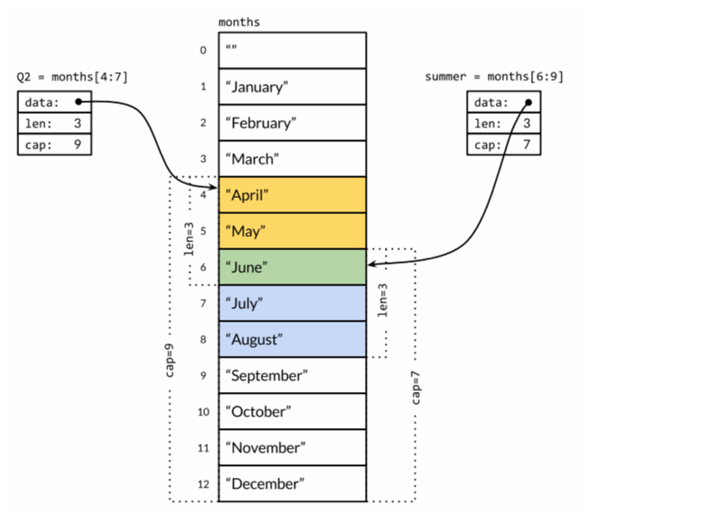

## 切片定义
首先我们要知道切片不是数组，也不是数组指针。
- 切片不需要指定长度
- 切片是引用类型
它通过内部指针和相关属性引用数组片段，来实现的变长的方案。

一个slice由三个部分构成：**指针**、**长度**和**容量**。



## 创建切片的方式
### 1.声明切片
```go
package main
func init() {
	var s1 []int
	s2 := []int
	s3 := []int{1,2,3} // 初始化赋值
}
```
### 2.make 函数
```go
package main
func init() {
	//这我们也要知道，第一个参数是类型
	//第二个参数是长度，第三个参数是容量
	s3 := make([]string, 0, 8)
}
```
### 3.从数组中切片
```go
package main
func init() {
	arr := [10]int{1,2,3,4,5,6,7,8,9,10}
	s1 := arr[3:6] // 前包后不包
	s2 := arr[4:]
	s3 := arr[:5]
	s4 := arr[:]
	s5 := arr[::5]
}
```

## len(slice) 和 cap(slice)
- len(slice) - 求当前切片的长度
- cap(slice) - 求当前切片的容量

## append(slice, tar)函数
使用`append(slice,tar)`来给切片来追加元素。**返回的是最新的slice对象**。
```go
package main
import (
	"fmt"
)
func main() {
	s1 := make([]int, 0 ,5)
	fmt.Printf("%p\n", &s1)
	
	s2 := append(s1,1)
	fmt.Printf("%p\n", &s2)
	
	fmt.Println(s1,s2)
}
```
这里我们可以通过查看指针来判断是否是同一个地址。是否发生了复制。

## cap 底层分配原理
如果切片操作超出`cap(s)`的上限将导致一个**panic**异常，但是超出`len(s)`则是意味着扩展了**slice**，因为新**slice**的长度会变大

这里我们说一个结论，就是当我们的容量超了之后，cap会自动在当前容量的基础上乘 2。
- 如果切片的容量小于1024，那么新的容量将是原容量的两倍。
- 如果切片的容量大于等于1024，那么新的容量将以原容量的1.25倍递增。
```go
package main
func appendInt(x []int, y int) []int {
	var z []int
	zlen := len(x) + 1 // 返回 x 的长度
	if zlen <= cap(x) { // 如果我们不超过x容量，我们可以不必扩容
		z = x[:zlen]
    } else { //  此刻，我们的len(x) = cap(x) 需要扩容
		zcap := zlen
		if zcap < 2*len(x) { // 我们扩容是 * 2 的算法
			zcap = 2*len(x)
        }
		z = make([]int, zlen, zcap)
		copy(z,x)
    }
	z[len(x)] = y
	return z
}
```
这里我们需要注意的就是，如果我们出现了扩容，我们会将里边的内容重新`copy`一份，放到新的地址里边，此刻我们的切片虽然还是
指向原来的地址，但是切片内部的子项，已经指向最新的地址了。我们如果修改里边的子项，是不会影响原始地址中的内容的。
```go
package main

func init() {
	source_arr := [7]string{
		"sunday",
		"monday",
		"tuesday",
		"wednesday",
		"thursday",
		"friday",
		"saturday",
	}
	work_day := source_arr[1:6]
	work_day[1] = "星期一"
	fmt.Println(work_day) // [monday 星期一 wednesday thursday friday]
	fmt.Println(source_arr) // [sunday monday 星期一 wednesday thursday friday saturday]

	work_day = append(work_day, "测试一", "测试二") // 此刻，已经超出了 cap
	fmt.Println(work_day) // [monday 星期一 wednesday thursday friday 测试一 测试二]
	work_day[2] = "星期二" // 修改第 3 项
	fmt.Println(work_day) // [monday 星期一 星期二 thursday friday 测试一 测试二]
	fmt.Println(source_arr) // [sunday monday 星期一 wednesday thursday friday saturday]
}
```

## 切片拷贝
我们使用`copy(slice1,slice2)`来实现拷贝。需要注意的是，函数`copy`在两个`slice`之间复制数据，
复制长度以`len`小的为准。
```go
package main
import "fmt"

func main() {
	s1 := []int{1,2,3,4,5}
	fmt.Printf("slice s1 : %v\n", s1)
	s2 := make([]int, 10)
	fmt.Printf("slice s2 : %v\n", s2)
	copy(s2, s1)
	fmt.Printf("copied slice s1 : %v\n", s1)
	fmt.Printf("copied slice s2 : %v\n", s2)
	s3 := []int{1, 2, 3}
	fmt.Printf("slice s3 : %v\n", s3)
	s3 = append(s3, s2...)
	fmt.Printf("appended slice s3 : %v\n", s3)
	s3 = append(s3, 4, 5, 6)
	fmt.Printf("last slice s3 : %v\n", s3)
}
```
## 字符串和切片
按照我们之前讲的，如果我们要修改字符串需要先将字符串转为数组。字符串的底层其实就是一个字节数组，
如果是中文的就是`rune`数组，所以我们也可以执行切片操作。

## 实践
- 旋转切片
```go
package main
func reverse(s []int) []int{
	for i,j:=0,len(s)-1; i <j; i,j = i+1,j+1 {
		s[i],s[j] = s[j],s[i]
    }
}

a := [...]int{0, 1, 2, 3, 4, 5}
reverse(a[:])
fmt.Println(a) // "[5 4 3 2 1 0]"

// 切片旋转 n 个元素
s := []int{0, 1, 2, 3, 4, 5}
reverse(s[:2])
reverse(s[2:])
reverse(s)
fmt.Println(s) // "[2 3 4 5 0 1]"
```
- 去掉空元素
```go
package main
import {
	"fmt"
}
func nonempty(strings []string) []string {
	i := 0
	for _,s := range strings {
		if(s != "") {
			strings[i] = s
			i++
        }
    }
	return strings[:i]
}
var data = []string{"one", "", "three"}
fmt.Printf("%q\n", nonempty(data)) // `["one" "three"]`
fmt.Printf("%q\n", data)           // `["one" "three" "three"]`
```
因此我们通常会这样使用`nonempty`函数：`data = nonempty(data)`。


