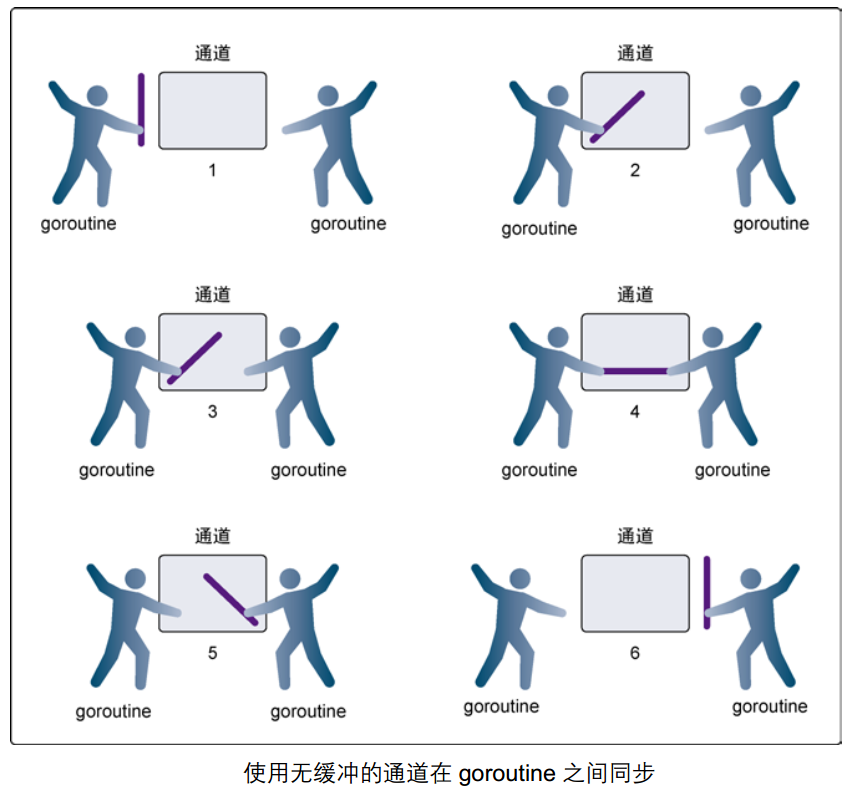
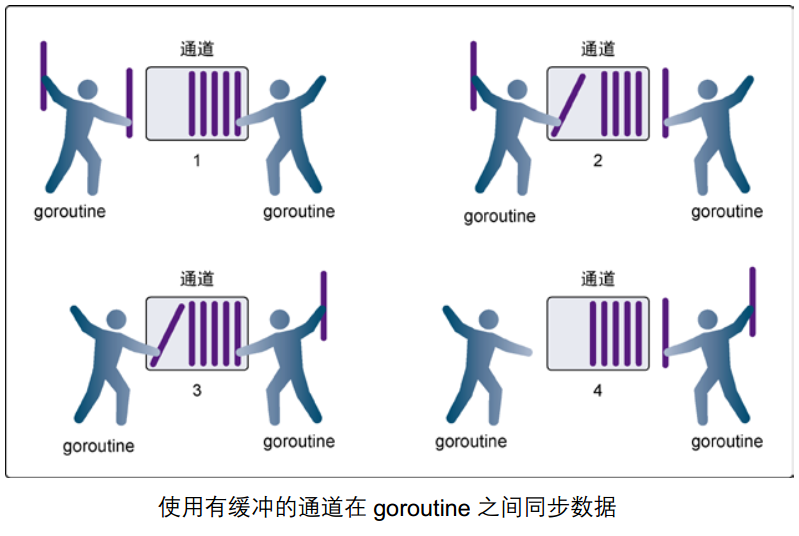
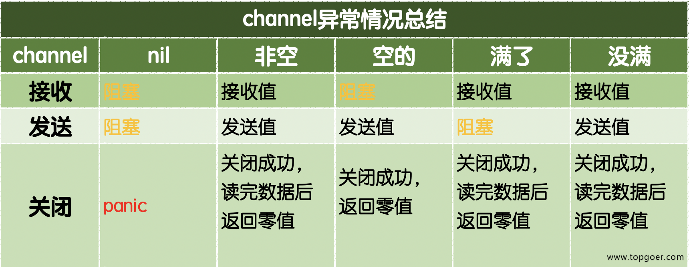

## 什么是并发
### 首先我们需要了解什么是进程？什么是线程？
> **进程**：进程是程序在操作系统中的一次执行过程，系统进行资源分配和调度的一个独立单位。
>
> **线程**：线程是进程的一个执行实体，是 CPU 调度和分派的基本单位，它是比进程更小的能独立运行的基本单位。
> 
> 一个进程可以创建和撤销多个线程。同一个进程中的多个线程可以并发执行。
### 并发和并行
> **并发**：多个程序在一个核的 CPU 上运行
> 
> **并行**：多线程序在多个核的 CPU 上运行
### 协程和线程
> **协程**：独立的栈空间，共享堆空间，调度由用户自己控制，本质上有点类似于用户级线程，这些用户级现成的调度也是自己实现的。
> 
> **线程**：一个线程上可以跑多个协程，协程是轻量级的线程。

## goroutine 
**goroutine**是由官方实现的超级“线程池”。每个`4~5KB`的栈内存占用和由于实现机制而大幅减少的创建和销毁开销是 Go 高并发的根本原因。
**goroutine**奉行通过通信来共享内存，而不是共享内存来通信。

### 使用goroutine
Go 语言中使用goroutine 非常简单，只需要在调用函数的时候在前面加上`go`关键字，就可以为一个函数创建一个`goroutine`。

一个goroutine必定对应一个函数，可以创建多个goroutine去指向相同的函数。

### 启动单个goroutine
```go
func hello() {
	fmt.Println("Hello Concurrency!")
}
func main() {
	hello()
	fmt.Println("main goroutine done!")
}
```
这个示例中`hello`函数和下面的语句是串行的，执行的结果是打印完`Hello Goroutine!`后打印`main goroutine done!`。

接下来我们在调用`hello`函数前面加上关键字`go`，也就是启动一个`goroutine`去执行`hello`这个函数。

````go
func main() {
    go hello() // 启动另外一个goroutine去执行hello函数
    fmt.Println("main goroutine done!")
}
````

这一次的执行结果只打印了`main goroutine done!`，并没有打印`Hello Goroutine!`。为什么呢？

当`main()`函数返回的时候该`goroutine`就结束了，所有在`main()`函数中启动的`goroutine`会一同结束，`main`函数所在的`goroutine`就像是权利的游戏中的夜王，其他的`goroutine`都是异鬼，夜王一死它转化的那些异鬼也就全部GG了。

所以我们要想办法让`main`函数等一等`hello`函数，最简单粗暴的方式就是`time.Sleep`了。
```go
func main() {
    go hello() // 启动另外一个goroutine去执行hello函数
    fmt.Println("main goroutine done!")
    time.Sleep(time.Second)
}
```
执行上面的代码你会发现，这一次先打印`main goroutine done!`，然后紧接着打印`Hello Goroutine!`。

首先为什么会先打印`main goroutine done!`是因为我们在创建新的`goroutine`的时候需要花费一些时间，而此时`main`函数所在的`goroutine`是继续执行的。

### 启动多个goroutine
在Go语言中实现并发就是这样简单，我们还可以启动多个`goroutine`。让我们再来一个例子： （这里使用了`sync.WaitGroup`来实现`goroutine`的同步）
```go
package main
import (
    "async"
)
var wg sync.WaitGroup

func hello(i int) {
	defer wg.Done()
	fmt.Println("Hello Concurrency!", i)
}

func main() {
	for i := 0; i < 10; i++ {
	    wg.Add(1) // 启动一个goroutine就等级 -1
		go hello(i)
    }
	wg.Wait()  // 等待所有等级的goroutine都结束
}
```

## runtime包

### runtime.Gosched()
让出CPU时间片，重新等待安排任务。
查看示例：[gosched](../pkg/Concurrency/Runtime/gosched/main.go)

### runtime.Goexit()
退出当前的协程。
查看示例：[goexit](../pkg/Concurrency/Runtime/goexit/main.go)

### runtime.GOMAXPROCS
Go运行时的调度器使用`GOMAXPROCS`参数来确定要使用多少个 OS 线程同时执行 GO 代码。默认是机器上的 CPU 核心数。

Go 可以通过`runtime.GOMAXPROCS()`函数设置当前程序并发时候占用的 CPU 逻辑核心数。

Go1.5版本之前，默认使用的是单核心执行。之后默认使用全部的 CPU 逻辑核心数。
查看示例：[gomaxprocs](../pkg/Concurrency/Runtime/GOMAXPROCS/main.go)

## Channel
单纯地将函数并发执行是没有意义的。函数与函数间需要交换数据才能体现并发执行函数的意义。

虽然可以使用共享内存进行数据交换，但是共享内存在不同的`goroutine`中容易发生竞态问题。为了保证数据交换的正确性，必须使用互斥量对内存进行加锁，这种做法势必造成性能问题。

Go语言的并发模型是**CSP**（Communicating Sequential Processes），提倡通过**通信共享**内存而不是通过**共享内存**而实现通信。

如果说`goroutine`是Go程序并发的执行体，`channel`就是它们之间的连接。`channel`是可以让一个`goroutine`发送特定值到另一个`goroutine`的通信机制。

> Go 语言中的通道（channel）是一种**特殊的类型**。通道像一个传送带或者队列，总是遵循**先入先出**（First In First Out）的规则，保证收发数据的顺序。每一个通道都是一个具体类型的导管，也就是声明**channel**的时候需要为其指定元素类型。

### channel 类型
因为我们说`channel`是一种类型，所以我们可以通过声明的方式来使用：
```go
var 变量 chan 元素的类型
```
```go
var ch1 chan int
var ch2 chan bool
var ch3 chan []int
```
### 创建 channel
- 通道是**引用类型**，所以空值是`nil`。
- 同样我们必须使用`make`函数初始化之后，分配空间，才可以使用。
```go
make(chan 元素类型, [缓冲大小])
```
缓冲大小是非必传的。
### channel 的方法
1. 通道有 **发送（send）、接收（receive）和关闭（close）** 三种主要操作。
2. 发送和接收都使用`<-`符号。

**定义**
```go
ch := make(chan int)
```
**发送**
```go
ch <- 10 // 把 10 发送到ch中
```
**接收**
````go
x := <- ch // 从 ch 中接收值并且给变量 x
<-ch // 从ch中接收值，忽略结果
````
**关闭**
```go
close(ch)
```
> ⚠️注意：
> 关于关闭通道需要注意的事情是，只有在通知接收方goroutine所有的数据都发送完毕的时候才需要关闭通道。通道是可以被垃圾回收机制回收的，它和关闭文件是不一样的，在结束操作之后关闭文件是必须要做的，但关闭通道不是必须的。

> **关闭的通道有以下特点：**
> 
> 1. 对一个关闭的通道再发送值就会导致panic。
> 2. 对一个关闭的通道进行接收会一直获取值直到通道为空。
> 3. 对一个关闭的并且没有值的通道执行接收操作会得到对应类型的零值。
> 4. 关闭一个已经关闭的通道会导致panic。

### 无缓冲通道

无缓冲模式通道必须得有接收者，如果没有接收者就会报错。

使用无缓冲通道进行通信将导致发送和接收的`goroutine`同步化。因此，无缓冲通道也被称为同步通道。

如果我们希望空值通道的执行顺序和生命周期，我们可以引入`sync.WaitGroup`来控制。

[代码示例](../pkg/Concurrency/Channel/noBuf/main.go)
### 有缓冲通道

我们可以在使用make函数初始化通道的时候为其指定通道的容量。

[代码示例](../pkg/Concurrency/Channel/buf/main.go)

### close()
可以通过内置的`close()`函数关闭**channel**。
[代码示例](../pkg/Concurrency/Channel/close/main.go)

### 如何优雅的从通道循环取值
当通过通道发送有限的数据时，我们可以通过`close`函数关闭通道来告知从该通道接收值的`goroutine`停止等待。当通道被关闭时，往该通道发送值会引发`panic`，从该通道里接收的值一直都是类型零值。

[代码示例](../pkg/Concurrency/Channel/practise/main.go)

### 单向通道
有的时候我们会将通道作为参数在多个任务函数间传递，很多时候我们在不同的任务函数中使用通道都会对其进行限制，比如限制通道在函数中只能发送或只能接收。

Go语言中提供了单向通道来处理这种情况。

[代码示例](../pkg/Concurrency/Channel/Unidirectional/main.go)
> 1. `chan<- int` 是一个只能发送的通道，可以发送但是不能接收；
> 2. `<-chan int` 是一个只能接收的通道，可以接收但是不能发送。



## select 多路复用
在某些场景下我们需要同时从多个通道接收数据。为了应对这种场景，Go内置了`select`关键字，可以同时响应多个通道的操作。

`select`的使用类似于`switch`语句，它有一系列`case`分支和一个默认的分支。每个`case`会对应一个通道的通信（接收或发送）过程。`select`会一直等待，直到某个`case`的通信操作完成时，就会执行`case`分支对应的语句。具体格式如下：
```go
select {
    case <-chan1:
       // 如果chan1成功读到数据，则进行该case处理语句
    case chan2 <- 1:
       // 如果成功向chan2写入数据，则进行该case处理语句
    default:
       // 如果上面都没有成功，则进入default处理流程
}
```
[代码示例](../pkg/Concurrency/Channel/Select/detail01/main.go)

如果多个`channel`同时`ready`，则随机选择一个执行
[代码示例](../pkg/Concurrency/Channel/Select/detail02/main.go)

可以用于判断管道是否存满
[代码示例](../pkg/Concurrency/Channel/Select/detail03/main.go)
