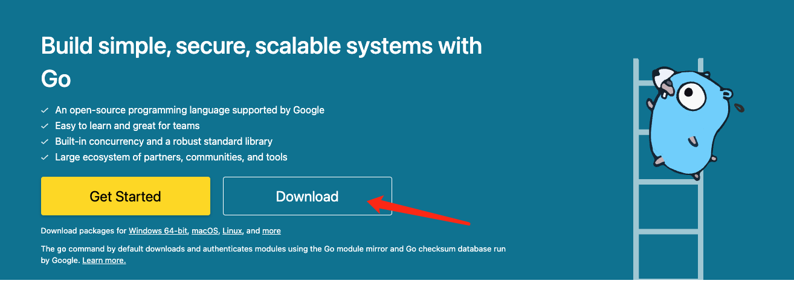
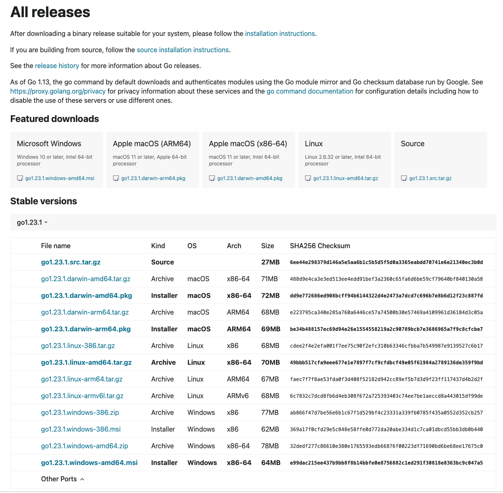

# 环境搭建
打开官网[Golang](https://go.dev/)，点击Download

然后选择版本下载


然后就是配置环境变量
```
export GOROOT=/usr/local/go        ##Golang安装目录
export PATH=$GOROOT/bin:$PATH
export GOPATH=/home/go  ##Golang项目目录
```

vscode 安装 go 插件

接下来 `cmd`+`shift`+`P`打开命令面板，输入 `go:install`